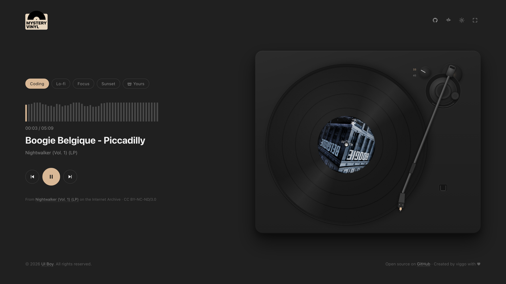
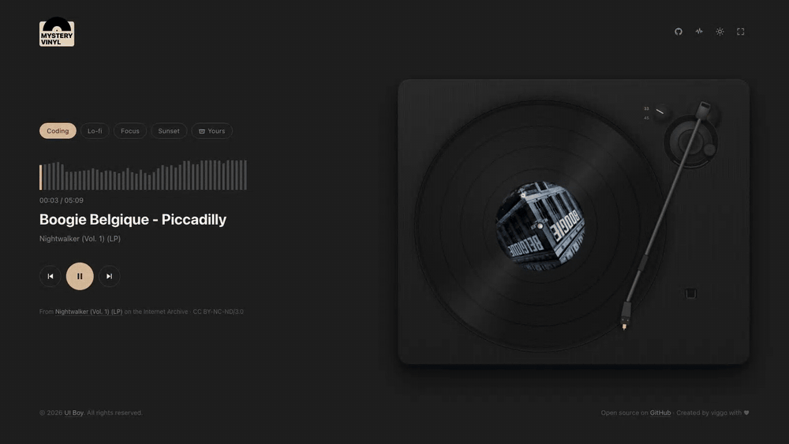
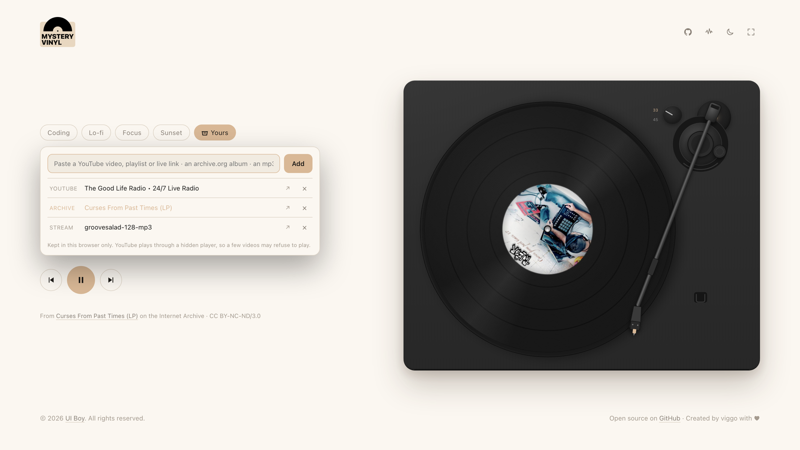
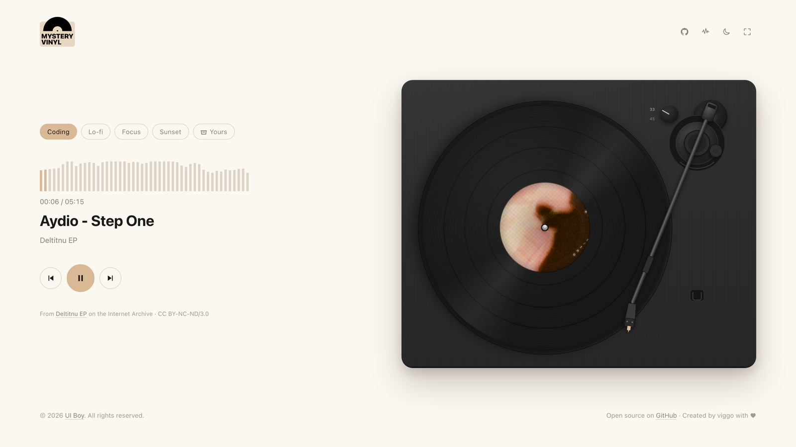
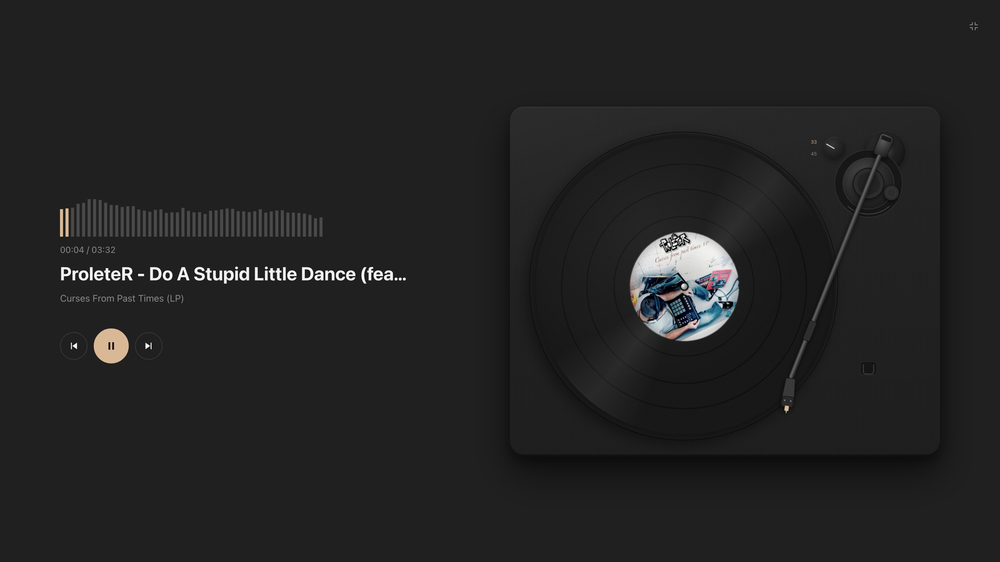

<p align="center">
  <a href="https://vinyl.uiboy.com/"></a>
</p>

<h1 align="center">Mystery Vinyl</h1>

<p align="center">
  Open the page, a record drops, music plays.<br>
  <a href="https://vinyl.uiboy.com/"><strong>vinyl.uiboy.com</strong></a>
</p>

<p align="center">
  
</p>

Pick a mood and the deck pulls a random record from that crate. The turntable on the right is not an image: the plinth, platter, record, grooves and sheen are CSS, the tonearm is SVG, and everything moves the way the real thing does.

## What it does

- **Drops the needle for you.** The tonearm swings over the lead-in groove, drops, and tracks inward as the song plays. Skipping brakes the platter, swaps the record and starts again.
- **Real turntable physics.** The platter spins at 33⅓ with motor pull-up and coast-down. The record sits on the mat with its own inertia, so it lags on start and overruns when the platter stops. A slightly warped pressing nudges the arm once per revolution.
- **Sounds like vinyl.** Surface hiss and random crackle are synthesized with Web Audio (no samples). On by default, `N` toggles it, its level lives in the Ambience panel. Dropping the needle thumps.
- **Room sounds.** The Ambience panel (headphone icon) has 88 loops from [Moodist](https://github.com/remvze/moodist) in nine groups: rain, nature, places, things, city, travel, animals, noise, binaural. Tap a tile to add a sound, mix levels in the list above, mute all in one click. The music itself has a row at the top of that mixer (Spotify's embed sets its own volume, so that row goes quiet while a Spotify link plays). They belong to the room, so they keep going when the record stops. Off by default, remembered per browser, downloaded only when switched on. Icons are [Pixelarticons](https://github.com/halfmage/pixelarticons).
- **Live waveform.** The bars are the actual spectrum from an `AnalyserNode`, coloured up to the playhead. Click to seek.
- **Grab the tonearm.** Drag the headshell along the record and let go to drop the needle there; drag it all the way out to the rest to pause.
- **Your own music.** Paste a YouTube video, playlist or live link, a Spotify link, an archive.org album, or an mp3 / radio stream into the *Yours* crate.
- **Light and dark**, a **full-screen** mode that hides everything but the deck, keyboard shortcuts, Media Session support for hardware keys.

## The crates

| Mood | What's in it | Source |
| --- | --- | --- |
| **Lo-fi** | Chillhop Music, Dreamhop, College Music records, plus the lofi radios everyone leaves on | Audius (official label accounts) + YouTube |
| **Focus** | Jazz and lo-fi from College Music and Radio Juicy, plus piano radios | Audius + YouTube |
| **Chill** | Positive chill / deep house: Good-Life-Radio style radios, Anjunadeep singles | YouTube + Audius |
| **Night** | Sleep lofi, ambient from College Music, Inner Ocean and Stereofox, late-night jazz radios | Audius + YouTube |
| **Yours** | Whatever you paste in | You |

Two kinds of source. **Audius** serves real audio with CORS headers, so those records get the live waveform, the crackle and a proper credit line (artist, label, link). Audius is the open catalog the labels publish to themselves: Chillhop Music has ~790 free-to-stream tracks there, College Music ~500. The build script keeps only tracks whose access allows streaming and skips paid ones. **YouTube** radios play through a hidden player (the same thing every lofi radio site does); live stream ids change when a channel restarts a stream, so `python3 scripts/build-catalog.py --check` asks yt-dlp which ones still play and drops the rest.

## Your own music

<p align="center">
  
</p>

The *Yours* chip opens your crate. Paste a link, press Add:

- **YouTube** video, playlist, mix or live stream. Played through a hidden IFrame player, so there is no waveform, and a few videos that forbid embedding are skipped automatically.
- **Spotify** track, album, playlist or episode link. Played through Spotify's hidden Embed player: full tracks only when this browser is logged in to Spotify, otherwise 30-second previews; an album or playlist plays through on its own (no skipping inside it).
- **archive.org** album (`archive.org/details/…`). Read client-side, full support: waveform, crackle, attribution.
- **mp3 / m4a / stream URL.** Icecast radio streams work and show as LIVE.

Click a source in the list to play it. Sources live in `localStorage` only.

## Two looks, and a quiet mode

<table>
  <tr>
    <td width="50%"></td>
    <td width="50%"></td>
  </tr>
  <tr>
    <td align="center">Light theme (<code>T</code>)</td>
    <td align="center">Full screen (<code>F</code>) — controls fade after a few seconds</td>
  </tr>
</table>

## Keyboard

| Key | Action |
| --- | --- |
| `Space` | Play / pause (pause lifts the arm back onto its rest) |
| `→` / `←` | Next record / restart or previous |
| `F` | Full screen |
| `T` | Light / dark |
| `N` | Vinyl crackle on / off |
| `A` | Ambience panel |
| `Esc` | Close the crate or panel, leave full screen |

## How the turntable is built

- **Record.** `repeating-radial-gradient` for the grooves, a second radial gradient for the wide bands between tracks, the album cover as the label. A `conic-gradient` sheen sits in a separate layer that does *not* rotate, so the reflection stays put while the grooves turn under it.
- **Tonearm.** One SVG group rotated about the bearing. The angle that puts the stylus on a given groove radius comes from the law of cosines over the pivot-to-spindle distance and the arm length, so lead-in and run-out land where they should. An inner group carries the per-frame wobble without fighting the CSS transition on the outer one.
- **Motion.** A `requestAnimationFrame` loop integrates two angular velocities (platter, record) with different time constants for pull-up, brake and coast. Everything else is CSS transitions.
- **Sound.** One `<audio>` element through an `AnalyserNode`. The crackle is a looped pink-noise buffer through a band-pass plus scheduled noise bursts, mixed to the destination on the audio clock so it keeps ticking in a background tab.

## Run it locally

Static files, no build step. The catalog is fetched, so serve over HTTP:

```sh
python3 -m http.server 8765
# open http://127.0.0.1:8765/
```

`data/catalog.json` is generated from the Audius label accounts and the YouTube list in `scripts/build-catalog.py`:

```sh
python3 scripts/build-catalog.py
```

Edit the `AUDIUS`, `YT` and `CATEGORIES` maps there to add or swap sources per mood. Note that YouTube refuses to play inside embeds served from `127.0.0.1` / `localhost` (error 150), so the YouTube radios only work on a real domain.

## Files

- `index.html` — markup, logo, the tonearm SVG, the crate popover
- `styles.css` — theme tokens, layout, the plinth / platter / record / sheen, zen mode, ambience panel
- `app.js` — queue and transport, platter physics, tonearm geometry, waveform, crackle, room sounds, YouTube and Spotify backends, crate
- `assets/sounds/` — the ambient loops (see `CREDITS.md` there)
- `scripts/build-catalog.py` — builds `data/catalog.json`

## License

Code is MIT. The music is not part of this repository: Audius tracks stream from the labels' own accounts under Audius's terms and are credited next to the player; YouTube content belongs to its owners; archive.org albums you paste in carry their own Creative Commons licenses. If you fork this for anything commercial, check each source's terms first.

Made by [Viggo](https://x.com/decohack) · more at [uiboy.com](https://uiboy.com/)
